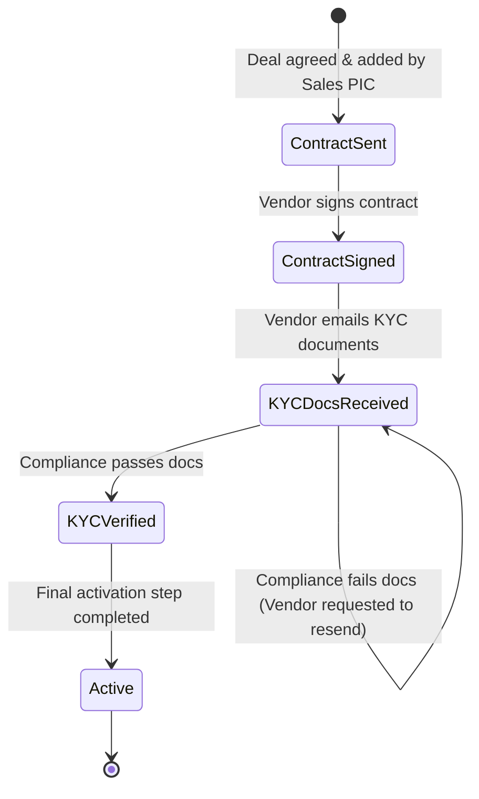

# vendor-onboarding-tracker

## The business problem

An Operations team is responsible for onboarding new vendors before they can start operating in a region. Today, the team manages this process using a shared spreadsheet.

## Current Process

A vendor goes through five stages:

1. **Contract Sent**  
   A Sales PIC signs a new vendor. Once a deal is agreed, the Sales PIC adds a new row to the spreadsheet with the vendor's information.
2. **Contract Signed**  
   An Ops Coordinator follows up until the vendor signs the contract. The coordinator then changes the vendor's stage to Contract Signed and manually updates the "Last Updated" date.
3. **KYC Docs Received**  
   The vendor sends KYC documents, such as a business license and identification documents, by email. A coordinator updates the vendor's stage to KYC Docs Received.
4. **KYC Verified**  
   Compliance reviews the documents outside the spreadsheet, usually through Slack. If the documents pass, a coordinator updates the vendor to KYC Verified. If they fail, the vendor is asked to resend the required documents and remains at KYC Docs Received.
5. **Active**  
   Once KYC is verified, a coordinator performs a final activation step in another internal system and updates the vendor to Active.

### Example Spreadsheet

| Vendor | Region | Stage | Last Updated | Coordinator | Notes |
| :--- | :--- | :--- | :--- | :--- | :--- |
| Company A | HCMC | Active | 2026-07-02 | Linh | |
| Company B | Can Tho | KYC Docs Received | 2026-07-18 | Huy | Waiting on business license re-upload |
| Company C | Hanoi | Contract Signed | 2026-07-28 | Linh | |
| Company D | HCMC | KYC Verified | 2026-08-01 | Mai | |
| Company E | Da Nang | KYC Docs Received | 2026-07-15 | Huy | |
| Company F | HCMC | Contract Sent | 2026-08-05 | Mai | |

Three Ops Coordinators may work with the spreadsheet during the day.

The team has noticed that managing onboarding this way is becoming harder as the number of vendors increases. For example, vendors can sometimes remain at the same stage for a long time without anyone noticing, and it can be difficult to understand what happens when information in the spreadsheet looks incorrect.

---

## Write-Up

My feedback and proposed solution after investigating the business process:

### 1. Main problems
#### 1.1. Process state machine
- Spreadsheets apps do not support data state machine. For example, the process from the business problem could be modelled as:



- Problem: Someone can change the state incorrectly, e.g. from `KYCVerified` backwards to `ContractSent`
- Solution: The webapp must check the state transition

#### 1.2. Audit history
- Problem: 
    + The process does not state that a vendor is followed by a single coordinator throughout its lifetime. As such, multiple people from the Ops Coordinator team can mutate a vendor's row. The current spreadsheet only tracks the latest mutator.
    + The Sales PIC is not tracked from the spreadsheet. It is impossible to trace back who signed the contract.
- Solution: The webapp must implement audit history: What action was done? Who did the action? When it occurred?

#### 1.3. KYC document tracing and data retention
- Problem: Compliance reviews the documents outside the spreadsheet. They are sent through emails (which are removable). If the number of vendors increase, it becomes harder to trace these documents which live outside the system.
- Solution: The webapp supports logging permalinks to these documents (e.g. email, Slack, Docusign)
- Assumption: The webapp does not have to store these documents.

### 2. Implementation
#### 2.1. Assumptions
- Authentication:
    + User data is mocked
    + There is no user registration, password reset and user administration
- Authorization:
    + There is a single role: Ops coordinator
- Vendors:
    + Vendor data is mocked
    + There is no vendor creation and deletion
    + A vendor is considered "stuck" if its last-update timestamp was exactly or more than 7 days old.
    + Vendor region is an arbitrary string input as there is no clarification that vendors are Vietnam-based
    + The dataset is small (and for demonstrating purpose) such that pagination is not required
    + Vendor stage transition is non-reversible. In addition, it follows a linear, step-by-step model.
- No extra features such as compliance review system, vendor activation system, notification/reminders, real-time updates
- No production deployment infra

#### 2.2. Technology
- Vite, Vitest
- Nuxt.js, Javascript
- Neon DB, Drizzle
- Plain CSS

#### 2.3. Technical decisions
- Nuxt: fast to implement. In addition, the validation logic stays consistent across client and server

#### 2.4. Database Schema
```
Users:
- ID: UUID (PK)
- Name: VARCHAR(255) (Not null)
- Role: VARCHAR(255) (Not null)
- CreatedAt: TIMESTAMP (Not null)
- UpdatedAt: TIMESTAMP

Vendors:
- ID: UUID (PK)
- Name: VARCHAR(255) (Not null)
- Region: VARCHAR(255) (Not null)
- Notes: TEXT
- CreatedAt: TIMESTAMP (Not null)
- UpdatedAt: TIMESTAMP

VendorProcess:
- ID: UUID (PK)
- Vendor --> Vendors.ID (Not null)
- User --> Users.ID
- PrevStage: VARCHAR(255) (Not null)
- NewStage: VARCHAR(255) (Not null)
- CreatedAt: TIMESTAMP (Not null)
```

Enums (moved to application-level):
1. User Role
	- `OPS_COORDINATOR`
2. Process Stage
	- `CONTRACT_SENT`
	- `CONTRACT_SIGNED`
	- `KYC_DOCS_RECEIVED`
	- `KYC_VERIFIED`
	- `ACTIVE`

**Seeded logins**
- Password for every coordinator: `229000`
	- `vi` / Vi
	- `linh` / Linh
	- `huy` / Huy
	- `mai` / Mai

#### 2.5. Potential Improvements

If I have more time, the following features could be implemented since they fit within the business context.
- Support an additional role: Sales IPC
- Vendor creation
- Pagination support
- User administration
- Enterprise SSO
- Notification and reminders (through Slack, email, etc)

Other features are considered unnecessary for an internal/backoffice tool:
- User registration, Password reset
- Vendor deletion
- Real-time updates

### 2.6. Testing
- Unit Testing:
	+ Process stage transition
	+ Vendor stuck identification

### 3. AI-assistance disclosure
#### 3.1. Tools
- Tools used: Cursor (Planning + Building)
- Models: Cursor Grok 4.6 (High)

#### 3.2. Prompts
##### 3.2.1. Planning
```
convert the document into Markdown
> generate mermaid code to represent the above process state machine

---

if A sends contract to B through emails, and either can delete the email. How does compliance process work in business?
> so what is the standard process to refer such attachment (documents) in another system such as spreadsheets? (e.g. used by People team)
```

##### 3.2.1. Implementation
```
Build a webapp to track vendor onboarding.

Technology:
- Vite, Vitest
- Nuxt.js, Javascript
- Neon DB, Drizzle
- Plain CSS

---

Features:
- Auth: Implement simple username-password authentication (Bcrypt). No user registration, password reset and user administration. Seed the user data. Cookie-based session.
- Vendor: No vendor creation and deletion. Seed the vendor data.

Hardcoding:
- Vendor stuck: 7 days

Screens:
1. Login
- Username and Password input
- Error message alert

2. View Vendors:
- Display the following table layout by joining Vendors, Users and the latest VendorProcess (sorted by createdAt descendingly), no pagination required
    + Vendor --> Vendors.Name
    + Region --> Vendors.Region
    + Stage --> SQL VendorProcess.NewStage
    + LastUpdate --> SQL Vendors.UpdatedAt
    + Coordinator --> SQL VendorProcess.User where user's role is OPS_COORDINATOR; otherwise, show "N/A"
    + Notes --> SQL Vendors.Notes (or empty if notes is unset)
    + History: shows the VendorProcess history (sorted descendingly by createdAt)
- The table is mutable at this column: Stage
- The table must highlight stuck vendors whose latest VendorProcess is older than the hardcoded stuck days by VendorProcess.createdAt (note: NOT by comparing the Vendors.updatedAt)

---

Business Logic:
1. Whenever an ops coordinator mutates the stage, explicitly show a dialog to ask for confirmation. 

Exception: Initially, prev stage = new stage = CONTRACT_SENT. For later stages, check prev stage != new stage and follow the state machine (application-level check): CONTRACT_SENT -> CONTRACT_SIGNED -> KYC_DOCS_RECEIVED -> KYC_VERIFIED -> ACTIVE

Note: Update the Vendors's updatedAt once success.


---

DB Schema:

Users:
- ID: UUID (PK)
- Name: VARCHAR(255) (Not null)
- Role: VARCHAR(255) (Not null)
- CreatedAt: TIMESTAMP (Not null)
- UpdatedAt: TIMESTAMP (nullable)

Vendors:
- ID: UUID (PK)
- Name: VARCHAR(255) (Not null)
- Region: VARCHAR(255) (Not null)
- Notes: TEXT (nullable)
- CreatedAt: TIMESTAMP (Not null)
- UpdatedAt: TIMESTAMP (nullable)

VendorProcess:
- ID: UUID (PK)
- Vendor --> Vendors.ID (Not null)
- User --> Users.ID (nullable)
- PrevStage: VARCHAR(255) (Not null)
- NewStage: VARCHAR(255) (Not null)
- CreatedAt: TIMESTAMP (Not null)

Enums (moved to application-level):
1. User Role
- `OPS_COORDINATOR`
2. Process Stage
- `CONTRACT_SENT`
- `CONTRACT_SIGNED`
- `KYC_DOCS_RECEIVED`
- `KYC_VERIFIED`
- `ACTIVE`

---

[DB seed]
User(name, username, password, role)
User: Vi, vi, 229000, Ops Coordinator
User: Linh, linh, 229000, Ops Coordinator
User: Huy, huy, 229000, Ops Coordinator
User: Mai, mai, 229000, Ops Coordinator

[Vendors]
Vendor(name, region)
Vendor: Vinh Hoan Corporation, Dong Thap
Vendor: Loc Troi Group, An Giang
Vendor: Masan Consumer, HCMC
Vendor: Gia Lai Coffee Company (GiCo), Gia Lai
Vendor: Intimex Group, HCMC
Vendor: Thanh Thanh Cong - Bien Hoa (TTC AgriS), Tay Ninh
Vendor: Dabaco Group, Bac Ninh
Vendor: Phuc Sinh Corporation, HCMC
Vendor: Visimex Joint Stock Company, Hanoi
Vendor: Minh Phu Seafood Corporation, Ca Mau

[VendorProcess]
Seed each vendor with a record of VendorProcess where PrevStage = NewStage = CONTRACT_SENT while User is unset

---

Testing:
+ Unit test: Process stage transition, Vendor stuck identification

---

Coding rules:
- Strictly follow standard coding and naming convention
- Break large code portions into small, manageable component, classes and packages
- Use the latest dependency release
```

### 4. Setup
1. Copy `.env.example` to `.env`.
2. Set `DATABASE_URL` to a Neon Postgres connection string.
3. Set `NUXT_SESSION_PASSWORD` to a random string of at least 32 characters.
```bash
npm install
npm run db:migrate
npm run db:seed
npm run dev
```
Open `http://localhost:3000`.

### 5. Scripts
- `npm run dev` — start the Vite-powered Nuxt dev server
- `npm run build` / `npm run preview` — production build
- `npm test` — Vitest unit tests for stage transitions
- `npm run db:generate` — generate Drizzle migrations from the schema
- `npm run db:migrate` — apply the SQL schema to Neon
- `npm run db:seed` — insert users, vendors, and initial `CONTRACT_SENT` processes

